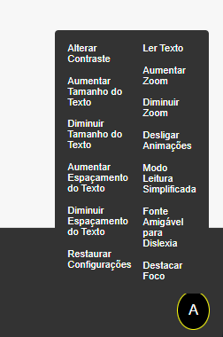

# A11y Hamburger Menu ♿  

Um menu de acessibilidade moderno, funcional e elegante para sites. Este projeto foi criado para promover inclusão digital, oferecendo ferramentas úteis para melhorar a experiência de navegação de todos os usuários.  

## Recursos ✨  

- **Alteração de contraste**: Melhora a visualização para usuários com baixa visão.  
- **Ajuste de tamanho do texto**: Permite aumentar ou diminuir o tamanho do texto para melhor legibilidade.  
- **Modo de leitura fácil**: Remove elementos visuais complexos para foco no conteúdo principal.  
- **Cursor ampliado**: Ajuda usuários com dificuldades motoras a localizar o cursor.  
- **Modo monocromático**: Transforma o site em tons de cinza para usuários com daltonismo.  

## Demonstração  
  

## Como Usar 🚀  

### 1. Instale os arquivos necessários  
Clone o repositório:  
```bash
git clone pedroGoffi/inclusive-web-menu
```  

### 2. Inclua os arquivos no seu projeto  
Adicione os arquivos CSS e JS ao diretório estático do seu site:  
- `a11y-hamburger-menu.css`  
- `a11y-hamburger-menu.js`  

### 3. Configure no HTML  
Insira o seguinte código no seu arquivo HTML ou EJS:  

```html
<div id="a11y-accessibility-hamburger-menu" class="a11y-menu">
  <button class="hamburger-icon" onclick="toggleA11yMenu()">
    <span id="accessibility-icon">A</span>
  </button>
  <div id="a11y-menu-options" class="a11y-menu-options">
    <ul>
      <li><a href="#" onclick="changeContrast()">Alterar Contraste</a></li>
      <li><a href="#" onclick="increaseTextSize()">Aumentar Tamanho do Texto</a></li>
      <li><a href="#" onclick="decreaseTextSize()">Diminuir Tamanho do Texto</a></li>
      <li><a href="#" onclick="resetSettings()">Restaurar Configurações</a></li>
      <!-- adicione aqui mais funcionalidade -->
    </ul>
  </div>
</div>
```

### 4. Personalize  
- Modifique o CSS para atender às suas necessidades visuais.  
- Adicione ou remova funcionalidades no arquivo JS conforme necessário.  

## Contribuições 🛠️  

Contribuições são bem-vindas! Sinta-se à vontade para abrir um _issue_ ou enviar um _pull request_.  

## Licença 📄  
Este projeto está licenciado sob a [MIT License](./LICENSE).  

## Créditos 🌟  
Desenvolvido com ❤️ por [Pedro Henrique Goffi de Paulo](https://www.linkedin.com/in/pedro-henrique-goffi-de-paulo-bb0426230/).  

## Vamos tornar a web mais acessível juntos! 🌍  
